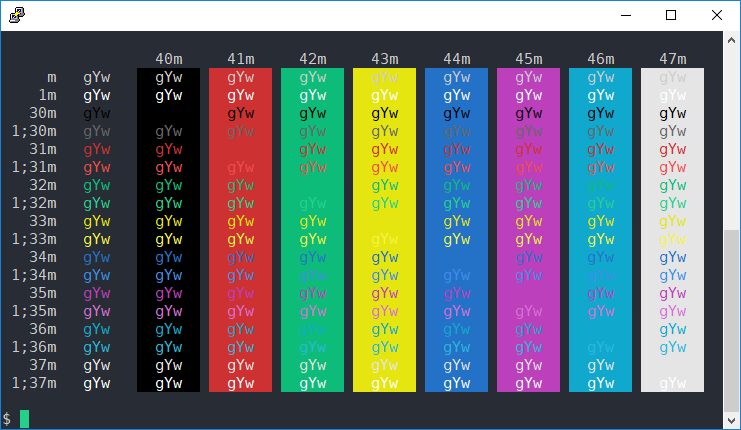

# VSCode + One Dark Putty Color Theme

https://github.com/AlexAkulov/putty-color-themes

https://putty.org.ru/articles/putty-256-colors-and-themes.html

## Usage

1. Drag'n'Drop `vscode.reg` onto `_puttycolor.js` in Windows Explorer for applying theme on _saved_ PuTTY sessions
    * Note that `_puttycolor.js` is `JScript`, _not_ `JavaScript`. If `.js` files are not associated with `JScript`,
      drag'n'drop will not work as expected
2. Or, double click on `vscode.reg` for applying theme to new PuTTY sessions
